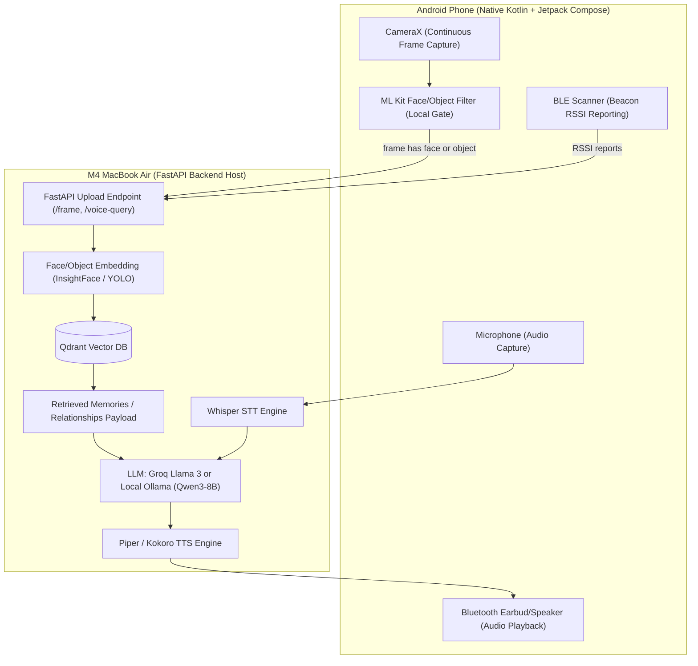

# Architecture Overview

## Data Flow Narrative

NeuroTwin employs a hybrid client-server architecture split between a lightweight **Android mobile client** (responsible for continuous ambient capture and local pre-filtering) and a high-performance **FastAPI backend running on an M4 MacBook Air** (responsible for heavy AI inference, vector search, and voice processing).

The system executes two primary asynchronous pipelines:

### 1. Ambient Visual Context & Embedding Pipeline
1. **Frame Capture:** CameraX continuously captures camera frames on the Android device at 1–2 fps.
2. **Local Pre-Filter:** ML Kit Face and Object Detection run locally on-device. If no face or relevant object is detected, the frame is immediately dropped to conserve network bandwidth and battery.
3. **HTTP Upload:** When a face or object is detected, the frame is uploaded over the local network (or WireGuard VPN) to the FastAPI `POST /frame` endpoint.
4. **Server Embedding Generation:** The backend passes the frame through InsightFace/FaceNet (for faces) or YOLO (for objects) to generate high-dimensional embeddings.
5. **Vector Database Retrieval:** The embedding is queried against the Qdrant vector database using Cosine Similarity matching.
6. **Context Cache:** Matched entity records (person details, relationships, memories, or object locations) are cached in the backend session state for immediate conversational retrieval.

### 2. Interactive Voice Question & Response Pipeline
1. **Voice Capture:** When the patient speaks (e.g., *"Who is standing near me?"* or *"Where are my glasses?"*), the Android client records the audio snippet.
2. **Speech-to-Text (STT):** The audio file is sent to the backend `POST /voice-query` endpoint, where Whisper transcribes the spoken phrase into text.
3. **Context Assembly & Prompting:** The backend retrieves the current visual context cached from the recent Qdrant matches and merges it with the Whisper transcript into a structured prompt.
4. **LLM Generation:** The assembled prompt is passed to the LLM (Groq Llama 3 API or local Ollama Qwen3-8B) configured with a warm companion system prompt.
5. **Text-to-Speech (TTS):** The generated text response is synthesized into low-latency audio via Piper or Kokoro TTS.
6. **Audio Playback:** The synthesized audio stream is sent back to the Android client and played back through the patient's Bluetooth earbud or speaker.

---

## Architecture Sequence Diagram

---

## Architectural Principles & Trade-offs

- **Compute Offloading:** Heavy ML operations (Whisper, LLM, InsightFace, YOLO, TTS) reside strictly on the server to prevent mobile thermal throttling and excessive battery drain.
- **Edge Data Minimization:** Video frames without detected interest are dropped on-device before hitting the network, protecting privacy and keeping server load low.
- **Decoupled Messaging:** Asynchronous processing allows frame analysis and voice processing to run independently without blocking the UI thread.
- **Hybrid Detection:** Visual (YOLO) and radio (BLE) detection complement each other. YOLO catches objects in camera view; BLE provides room-level location when objects are out of frame.
- **Privacy-First Audio:** Voice recordings are processed ephemerally — WAV files are deleted immediately after Whisper transcription. No audio is stored long-term.

---

## Related Documentation
- [[03 - Mobile Client (Android)]] — Android app structure, CameraX, and local ML Kit filters.
- [[04 - Backend (FastAPI on M4)]] — FastAPI REST API endpoints and M4 hardware resource allocation.
- [[05 - AI Pipeline]] — Detailed embeddings, vector search thresholds, and prompt design.
