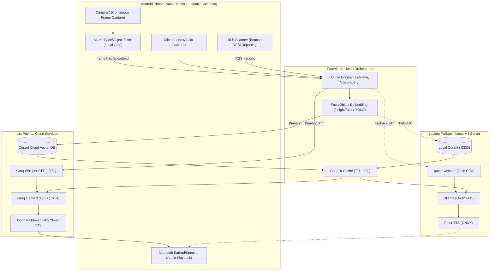

# Architecture Overview

## Data Flow Narrative

NeuroTwin employs a **Cloud-First Hybrid Client-Server Architecture** split between a lightweight **Android mobile client** (responsible for continuous ambient capture and local pre-filtering) and a high-performance **FastAPI backend** (hosted on cloud/local infrastructure).

The backend executes a **Cloud-First, Local-Fallback** strategy:
- **Priority 1 (Cloud APIs):** Real-time processing leverages ultra-low-latency cloud APIs (Groq Llama 3.3 for LLM at ~0.5s, Groq Whisper for STT, Qdrant Cloud, and Google Cloud / Azure Neural TTS) for seamless conversational companion responses.
- **Priority 2 (Local M4 Fallback):** If cloud APIs fail, experience rate limits, or network connectivity is lost, the backend automatically falls back to local models running on the host machine (M4 MacBook Air or local server) with Ollama (Qwen3-8B), local Qdrant, faster-whisper, and Piper TTS.

The system executes two primary asynchronous pipelines:

### 1. Ambient Visual Context & Embedding Pipeline
1. **Frame Capture:** CameraX continuously captures camera frames on the Android device at 1–2 fps.
2. **Local Pre-Filter:** ML Kit Face and Object Detection run locally on-device. If no face or relevant object is detected, the frame is immediately dropped to conserve network bandwidth and battery.
3. **HTTP Upload:** When a face or object is detected, the frame is uploaded over HTTP/HTTPS to the FastAPI `POST /frame` endpoint.
4. **Embedding Generation:** The backend passes the frame through InsightFace/FaceNet (for faces) or YOLO/ML Kit (for objects) to generate 512-d embeddings.
5. **Vector Database Retrieval:** The embedding is queried against **Qdrant Cloud** (with seamless fallback to local Qdrant instance) using Cosine Similarity matching.
6. **Context Cache:** Matched entity records (person details, relationships, memories, or object locations) are cached in the backend session state for immediate conversational retrieval.

### 2. Interactive Voice Question & Response Pipeline
1. **Voice Capture:** When the patient speaks (e.g., *"Who is standing near me?"* or *"Where are my glasses?"*), the Android client records the audio snippet.
2. **Speech-to-Text (STT):** The audio file is sent to `POST /voice-query/audio`.
   - *Primary:* **Groq Whisper API** (whisper-large-v3, ~0.8s latency).
   - *Fallback:* Local **faster-whisper (base CPU)** on the server.
3. **Context Assembly & Prompting:** The backend retrieves the current visual context cached from the recent vector matches and merges it with the transcript into a structured prompt.
4. **LLM Generation:**
   - *Primary:* **Groq Llama 3.3 70B** API (~0.5s response time).
   - *Fallback:* Local **Ollama Qwen3-8B** on M4 (~15-25s) or rule-based warm persona response.
5. **Text-to-Speech (TTS):**
   - *Primary:* **Google Cloud TTS / Azure Neural TTS** for lifelike conversational audio.
   - *Fallback:* Local **Piper TTS** (`en_US-lessac-medium`).
6. **Audio Playback:** The synthesized audio stream is sent back to the Android client and played back through the patient's Bluetooth earbud or speaker.

---

## Architecture Sequence Diagram

---

## Architectural Principles & Trade-offs

- **Cloud-First for Conversational Real-Time Performance:** High-speed cloud APIs reduce end-to-end voice latency from ~25s (local M4 CPU Ollama) to < 1.5s, delivering an interactive conversational experience for dementia patients.
- **Fail-Safe Local Redundancy:** If internet connectivity drops or cloud APIs encounter rate limits, the local M4 services take over with zero disruption to functionality.
- **Edge Data Minimization:** Video frames without detected interest are dropped on-device before hitting the network, protecting privacy and keeping bandwidth usage minimal.
- **Decoupled Messaging:** Asynchronous processing allows frame analysis and voice processing to run independently without blocking the UI thread.
- **Hybrid Detection:** Visual (YOLO/InsightFace) and radio (BLE) detection complement each other. Visual handles immediate view; BLE provides room-level location when objects are out of frame.
- **Privacy-First Audio:** Voice recordings are processed ephemerally — WAV files are deleted immediately after transcription.

---

## Related Documentation
- [[03 - Mobile Client (Android)]] — Android app structure, CameraX, and local ML Kit filters.
- [[04 - Backend (FastAPI on M4)]] — FastAPI REST API endpoints and service orchestration.
- [[05 - AI Pipeline]] — Detailed embeddings, cloud APIs, and fallback tiers.
- [[09 - Decisions Log]] — ADR #10 (Hybrid Cloud-First Architecture with Local Fallback).
